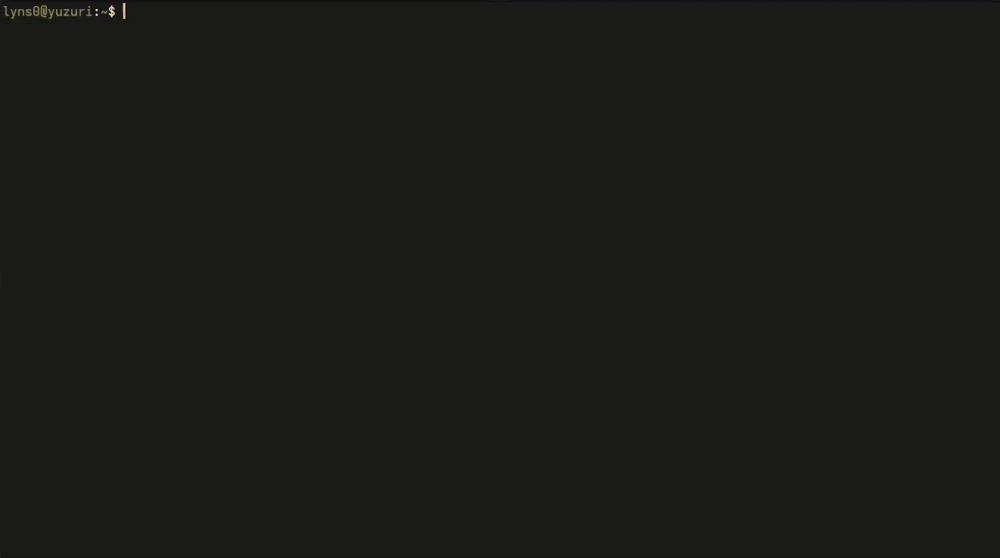

# Firefly, Terminal Audio Player
Written in Rust with audio playback handled by [Rodio](https://github.com/RustAudio/rodio) and UI built with [Ratatui](https://ratatui.rs/).

(Showcase as of v0.7.0, using [Kitty](https://sw.kovidgoyal.net/kitty/) with Atelier Dune Dark theme.)
## Features (v0.10.0)
- Play, Pause, Rewind, and Seek.
- Persistent Playlists
- Volume Control from 0-200%
- Track Looping
- Pick Files from File Dialog or Command-Line Argument.
- Track and Directory queuing
- Queue Arrangement, Shuffling, Clearing
- Skip Forward or Backward
- Metadata Display (Cover Art, Title, Artist, Album, Year, Bit Depth, Sample Rate, Bitrate)

### Formats Supported
- FLAC ([Symphonia](https://github.com/pdeljanov/Symphonia))
- MP3 ([Symphonia](https://github.com/pdeljanov/Symphonia))
- WAV ([Symphonia](https://github.com/pdeljanov/Symphonia))
- Opus ([opus-rs](https://github.com/SpaceManiac/opus-rs))

It can still play other formats by converting formats not supported by Rodio to FLAC using [rust_ffmpeg](https://github.com/RustNSparks/ffmpeg-suite-rs).

Temporary FLAC files stay on disk for reuse, which can be cleared by running `cargo run --release -- clean` or `firefly clean`

### Roadmap - open to suggestions
- [x] Playlists (v0.6.0)
- [x] Album art display for supported terminals (v0.7.0)
- [x] UI overhaul (v0.7.0)

## Usage
### Windows
- [Prebuilt Binary](https://github.com/ilialyl/firefly/releases/latest) (Extract first)
#### Optional Dependencies
- [FFmpeg](https://ffmpeg.org/) (If you want to play unsupported file types.)

### Fedora Linux
Build from source.
#### Dependencies
- [Cargo](https://doc.rust-lang.org/cargo/getting-started/installation.html)
- [wayland-devel](https://packages.fedoraproject.org/pkgs/wayland/wayland-devel/)
- [alsa-lib-devel](https://packages.fedoraproject.org/pkgs/alsa-lib/alsa-lib-devel/)
- [opus-devel](https://packages.fedoraproject.org/pkgs/opus/opus-devel/)
- [FFmpeg](https://ffmpeg.org/) (only if the file type you want to play isn't listed above)
```
# Install dependencies
sudo dnf install wayland-devel alsa-lib-devel rust opus-devel cargo git

# Clone the repository
git clone https://github.com/ilialyl/firefly && cd firefly

# Build and run (optimized)
cargo run --release
```

### CLI Examples
```
# Launch with a single file or directory
cargo run -r -- with example.mp3
cargo run -r -- with music/

# Launch with multiple files or directories
cargo run -r -- with example.mp3 music/

# Launch with multiple files using [wildcards](https://www.malikbrowne.com/blog/a-beginners-guide-glob-patterns/)
cargo run -r -- with ./**/*.opus
```

## Known Issue
- Rewinding can be slow on systems that use [ALSA](https://www.alsa-project.org/wiki/Main_Page).
- Wezterm (Windows) does not display cover art.
- Does not work with WSL as no audio output is connected.

## Bug Report
If you find any bugs, you can open an [issue](https://github.com/ilialyl/firefly/issues). I will get to it as soon as possible.
