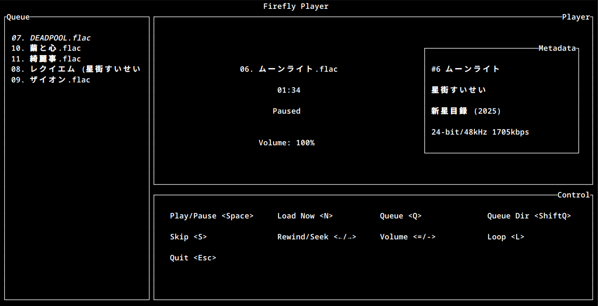

# Terminal Audio Player
Written in Rust with audio playback handled by [Rodio](https://github.com/RustAudio/rodio) and [Ratatui](https://ratatui.rs/) for interface.

## Features
- Play, Pause, Rewind, and Seek.
- Volume control from 0-200%
- Track Looping
- File Dialog
- Track and Directory queuing
- Queue arrangement
- Track Skipping
- Metadata display (Title, Artist, Album, Year, Bit Depth, Sample Rate, Bitrate)

### Formats supported by Rodio playback backend, [Symphonia](https://github.com/pdeljanov/Symphonia)
- FLAC
- MP3
- Vorbis (ogg)
- WAV

It can still play other formats by converting formats not supported by Rodio to FLAC using [rust_ffmpeg](https://github.com/RustNSparks/ffmpeg-suite-rs).
### Tested Converted Formats
- Opus
- OGA

### Planned Features
- [ ] Playlists
- [ ] YTDLP integration
- [ ] Music Library
- [ ] Graphical user interface (GUI)

## Usage
### Windows
- [Prebuilt Binary](https://github.com/ilialyl/firefly/releases/latest) (Extract first)
- Build from source

### Fedora Linux
Build from source.
#### Requirements
- [Cargo](https://doc.rust-lang.org/cargo/getting-started/installation.html)
- [wayland-devel](https://packages.fedoraproject.org/pkgs/wayland/wayland-devel/)
- [alsa-lib-devel](https://packages.fedoraproject.org/pkgs/alsa-lib/alsa-lib-devel/)
#### Steps
1. Clone this repository
2. run `cargo run --release`

### Others
Building from source is possible but instruction is omitted due to unknown list of dependencies.

## Known Issue
- Rewinding can be slow on systems that use [ALSA](https://www.alsa-project.org/wiki/Main_Page).

## Bug Report
If you find any bugs, you can open an [issue](https://github.com/ilialyl/firefly/issues). I will get to it as soon as possible.
